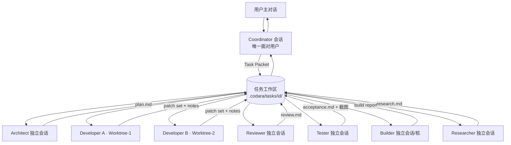
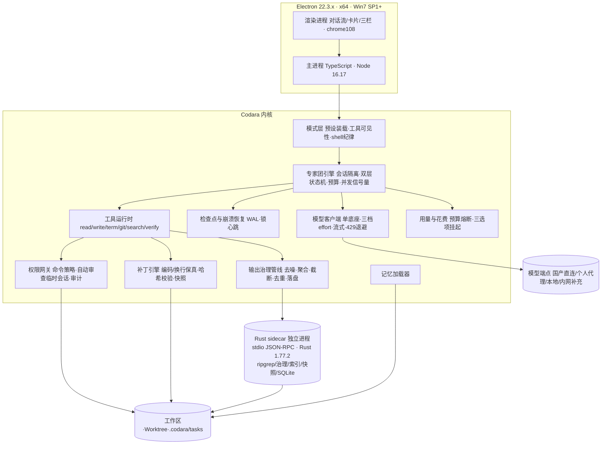

# Codara —— 对话式编程 Agent 开发主提示文档（v1.1）

> **产品名**：Codara（/koʊˈdɑːrə/）
> **文档版本**：v1.1（目标用户定位修订：个人开发者为首要用户；首发形态删除绿色便携版）
> **日期**：2026-09-21
> **文档性质**：投喂给 AI 编程助手的最高优先级系统提示词 + 产品与工程规格书。
> **变更规则**：带 `【待决策】` 的条目禁止 AI 自行拍板；与本文档冲突的需求先指出冲突、请求人类确认，禁止静默偏离。

---

## ★ 文档分层说明（编写期唯一主文档 → 入库后拆分）

本文件是编写期唯一主文档；进入仓库后必须拆分为两层，禁止让开发助手每会话全读本万字规格：

1. **`AGENTS.md`（项目根，每次会话自动注入）**：只含「第 0 章元指令」+「第 5 章硬约束清单摘要」+「文档索引」，控制在约 200 行内。
2. **`docs/spec/codara-spec.md`（完整规格）**：本文档第 1～11 章及附录全文。
3. **`docs/spec/adr/`**：ADR 独立成文；**`docs/spec/registers/`**：兼容性风险登记表、依赖准入单、待决策/待验证登记表；**`docs/spec/modes/`**：各 Agent 预设（模式）独立提示词文件，第 3 章为其权威来源。
4. 路径区分：产品运行时读取的是**用户项目**里的 `AGENTS.md`（用户的项目记忆，见 7.6）；Codara **自身仓库**的 `AGENTS.md` 是开发约束，二者不得混淆。

---

## 第 0 章 给 AI 开发助手的元指令（最高优先级，本块整体进 AGENTS.md）

0.1 **定位红线**：Codara 是**对话式自然语言驱动的编程 Agent**，不是 IDE。任何把产品往"代码编辑器/IDE"方向做的设计（内置完整编辑器、以文件树为主交互、调试器、编译器集成）都是方向性错误，必须拒绝并提示。

0.2 **兼容红线**：任何依赖、API、语法、构建配置引入前，必须先过第 5 章兼容性红线；不能确认则写入《兼容性风险登记表》并给替代方案，禁止侥幸引入。

0.3 **专家团红线**：专家团是**一个底座模型 + 多个角色化独立会话**。角色会话物理隔离、历史互不可见，只通过调度器与结构化交接物通信；禁止共享对话历史，禁止默认给不同角色配置不同模型。

0.4 **模式红线**：**极简长编码模式是官方默认模式**（见第 3 章）。该模式下模型只可见 `read / write / terminal / git / search` 五类工具，默认 shell 为 cmd.exe，必须遵守 Token 纪律与输出治理；新增工具或模式必须经人类批准并写入第 3 章。

0.5 **先计划后执行**：每个里程碑先产出 WBS、影响文件清单、测试计划，人类确认后再写代码。

0.6 **小步闭环**：单次改动可审查；功能点自测通过再继续；禁止堆积未验证代码。

0.7 **事实纪律**：版本号、兼容性结论、跑分数据必须有可追溯来源，且**引用 benchmark 必须同时给出基准版本与测试条件**，禁止只引用对结论最有利的数字；不确定写 `【待验证】`，禁止编造。

0.8 **失败处理**：同一报错连续出现 2 次，停止重试，做根因分析（RCA），写假设与验证步骤；禁止陷入"修复→失败→再修复"的循环。

0.9 **交付要素**：每轮交付包含改动清单、决策理由、自测结果、遗留问题、下一步。Win7 虚拟机日志/截图**仅在触碰兼容红线、原生依赖、打包安装链路的改动时强制提供**，其余改动说明自测方式即可。

0.10 **破坏性操作**（删文件、改 Git 历史、对外网络、安装系统级软件）必须暂停请求人类确认。

0.11 **安全诚实**：软沙箱不是内核级安全边界；文档与 UI 中不得做出"绝对隔离/绝对防住"的表述。

0.12 **首要用户红线（v1.1 新增）**：一切产品设计、安装体验与默认配置以**个人开发者"自有电脑、愿装愿用、开箱即用"**为基准；政企/工控等强管控场景是补充市场，不得为其牺牲主流用户的安装流畅度与默认体验。

---

## 第 1 章 产品定位

### 1.1 一句话定义

**Codara 是一个运行在 64 位 Windows 7 SP1 / 8.1 / 10 上的对话式编程 Agent：个人开发者用自然语言在聊天窗口描述目标，Codara 自主读懂代码库、制定计划、调用内置工具、以可预览可回滚的补丁修改代码、运行验证并汇报结果。**

### 1.2 它是什么 / 不是什么

**表 1-1　产品边界**

| 它是 | 它不是 |
|---|---|
| 聊天窗口为唯一主交互的任务型 Agent | 不是 IDE（没有以编辑器为中心的工作区） |
| 自然语言驱动：说目标，它交付结果 | 不是代码补全插件（不做行内补全竞争） |
| 自主运行内置工具完成端到端任务 | 不是 CLI 工具的图形壳子 |
| 代码以**只读查看 + diff 预览**呈现 | 不提供常驻代码编辑画布（用户继续用自己的编辑器） |
| 单模型多角色的专家团调度系统 | 不是多模型拼盘；底座只有一个，整体切换 |
| Win7 SP1～Win10 的 64 位兼容、可离线、可接本地模型 | 不依赖科学上网与海外支付；不支持 32 位系统与 Win7 RTM |

### 1.3 支持边界（v1.0 锁定）

- **仅支持 x64（64 位）**。安装器在 32 位系统上明确提示并退出，不提供 ia32 安装包。
- **Windows 7 必须安装 SP1**；无 SP1 的 RTM 系统不支持，安装器检测并提示安装 SP1 后重试。
- 签名安装包在 Win7 上依赖 SHA-2 补丁链（KB4474419，及对应服务堆栈更新如 KB4490628）；M0 产出《最小必需 KB 清单》，安装向导检测缺失补丁并给出一键引导（"默认勾选可跳过"还是"必装阻断"见待决策 #14）。低补丁环境使用离线全量安装包验证。

### 1.4 目标用户与差异化

**表 1-2　目标用户与价值**

| 用户群 | 痛点 | Codara 的价值 |
|---|---|---|
| **个人/独立开发者、自由职业者、学生（首要目标用户）** | 想用海外 Agent 编程工具但需科学上网、订阅贵且需外币支付；新版工具普遍只支持 Win10 1809+，旧电脑装不上；API、代理、运行环境配置繁琐；预算敏感、怕长任务挂机烧钱；怕 Agent 乱改代码搞崩项目无人兜底 | 国产模型端点直连、预置模板零配置、自带 Key 一分钟开用；低价档位/缓存优惠与本地模型兜底，花费可见、预算熔断；Win7 SP1～Win10 x64 老电脑可装，安装器自动检测并补齐运行环境；diff 审批 + 一键回滚 + 崩溃恢复，敢放手挂机 |
| 老项目/工控/嵌入式维护者 | 老语言栈、GBK 编码、CRLF、构建链古老，新工具在老环境跑不起来 | 编码/换行原样保留、补丁管线不破坏文件、低资源占用、可离线 |
| 学生、编程学习者、培训/教学机房 | 预算低、机器旧且配置参差、教学环境需统一、网络受限 | 低价与本地模型选项、零配置模板、离线全量安装包、环境统一 |
| 政企/制造业/国企研发（补充市场，非设计主导） | 机器锁定 Win7、禁外网、软件白名单、可能无管理员权限 | Win7 兼容、国产/内网端点、离线能力可天然部分覆盖；其强管控与无管理员权限诉求不主导产品设计，企业化能力（统一管控、部署模板等）另行评估排期 |

**五个差异化支柱（以个人开发者为第一服务对象）：**

1. **门槛最低，一分钟用上 AI 编程**：预置国产模型端点模板，直连无需科学上网，不依赖海外支付；自带 Key 即开即用，从安装到开始对话约一分钟，零环境配置。
2. **老电脑不淘汰**：Win7 SP1～Win10（x64）全兼容——同类新产品普遍只支持 Win10 1809+；低资源占用，学生时代的旧笔记本、家里的老台式机仍可服役；安装器自动检测并引导补齐系统补丁。
3. **对话即全部**：计划、审批、终端、diff、验收报告全部是对话流中的卡片，不切换工具、不改变用户原有编辑器习惯。
4. **默认就省钱**：极简长编码为官方默认模式，工具与 token 消耗压到最小；用量与花费实时可见、预算到顶自动挂起；本地模型可零成本离线兜底。
5. **敢让 Agent 自己动手**：逐次审批是默认承诺，补丁预览、快照一键回滚、断电崩溃可恢复；个人开发者没有运维团队兜底，也能放心开 Goal 挂机跑长任务。

> 注：离线、可换国产/内网端点、Win7 兼容等能力会天然覆盖工控、政企等补充场景，但产品设计与安装体验以个人开发者"自有电脑、愿装愿用、开箱即用"为基准，不为强管控场景牺牲主流用户的安装流畅度。

### 1.5 核心用户故事

- U1：个人开发者在自己的 Win7 SP1 x64 / 8.1 / 10 电脑上运行安装包；安装器检测架构与系统版本（32 位系统、Win7 RTM 明确提示不支持并退出），自动检测并引导补齐 SHA-2 补丁链等必需运行环境，一键完成安装；启动后选择预置的国产模型模板、填入 Key 即可开始对话。
- U2：对 Codara 说"这个老项目编译不过，帮我修好"，它先通读仓库、给出计划卡片，批准后执行，最后汇报改动与验证结果。
- U3：每次改文件，对话里先出现 diff 卡片；**逐次审批是默认承诺**；Goal 挂机如需批量预授权，必须在进入时用专门确认界面告知放弃了哪些审批（见 4.7）。
- U4：说"同时做两件事：修登录 bug、加导出 Excel"，两个 Developer 实例各自在独立 Git Worktree 并行。
- U5：长任务说"做完叫我"，Codara 挂机：跑测试→失败→读日志→修复→重跑；即使中途崩溃/断电，重启后可从检查点恢复。
- U6：断网时切换本地模型端点，本地工具全部可用，代码不离开机器。
- U7：用户可在左栏查看每个专家会话的状态与交接物；角色彼此看不到对方对话记录。
- U8：默认极简模式下，对话与工具输出没有废话与噪音，长任务挂机数小时 token 消耗仍可控。
- U9：预算敏感的学生/个人开发者在用量面板随时查看 token 与花费，使用低价档位或本地模型完成全天编码任务；达到预算上限时 Codara 自动挂起并给出续预算/切换模型/终止三个选项，不产生意外账单。

---

## 第 2 章 交互形态（对话即产品）

### 2.1 三栏布局

**图 1　三栏布局示意**

```
┌─────────────┬────────────────────────────┬─────────────────────┐
│ 左栏         │ 中栏（主交互：对话流）       │ 右栏（上下文侧栏）    │
│ 工作区/任务树 │  用户消息                   │ 本次任务改动文件      │
│  · 主对话    │  Agent 回复                 │ 审批队列             │
│  · 专家会话  │  计划卡片（可勾选/批准）      │ 终端标签（可折叠）     │
│    （隔离）  │  工具调用流水（可展开）       │ 交接物列表            │
│  · 并行任务  │  Diff 卡片（批准/拒绝）      │ 仓库地图/符号         │
│  · Worktree │  终端输出块（已治理）         │ 审计日志             │
│    标记      │  验收报告卡片               │ 模型/档位/并发/花费   │
└─────────────┴────────────────────────────┴─────────────────────┘
```

中栏是绝对主角；右栏可折叠，老机模式默认收起。代码只出现在**只读查看器**（带行号不可编辑）与 **Diff 卡片**中。终端是对话流中的可折叠输出块 + 右栏可交互标签。

### 2.2 九类结构化卡片

计划、任务派发、工具调用、Diff、审批申请、终端输出、验收报告、交接物、回滚。每类卡片是结构化数据（非纯文本），带按钮操作（批准/拒绝/重试/展开/回滚）。**用量与花费**在状态栏与右栏常驻展示（今日/本任务 token 与预估费用、预算上限进度条）。

### 2.3 任务模式（用户授权维度）

- **Ask**：只读，不写文件、不执行写命令；最低消耗。
- **Plan**（默认）：只探查与规划，产出分阶段计划（步骤、影响文件、风险、验证方式），批准后转执行。
- **Goal**：给定目标与验收标准后挂机自驱，跨角色多轮执行直到达成或卡点求助；进入前必须完成 4.7 的预授权告知。

> 任务模式（Ask/Plan/Goal）与第 3 章的 Agent 预设（极简长编码/标准/多模态/PTC）是两个正交维度，组合关系见 3.1。

### 2.4 视觉与一致性

自研扁平浅色主题为默认（不依赖 Win10 Fluent/亚克力），深色主题必备；内置开源字体（许可证随产品列出）；1024×768 起可用，高 DPI 适配；键盘可完成全部操作；老机模式关闭动画、右栏收起、单任务、索引限速。极简模式专用 UI 进一步收敛（单窗口、无动画、终端并入对话流，见 3.7）。

---

## 第 3 章 模式体系（Agent 预设）

### 3.1 两个正交维度

**表 3-1　模式维度**

| 维度 | 取值 | 决定什么 |
|---|---|---|
| 任务模式（用户授权） | Ask / Plan / Goal（见 2.3） | Agent 能走多远、何时需要人批准 |
| Agent 预设（工具与行为） | 极简长编码（**官方默认**）/ 标准 / 多模态（二期）/ PTC（v2） | 模型可见哪些工具、系统提示词、输出风格与 shell 纪律 |

默认组合：**Plan + 极简长编码**。Goal 挂机默认同样使用极简长编码；需要专家团分工时由系统自动进入标准预设（用户可见提示）。

### 3.2 Agent 预设总览

**表 3-2　预设对照（借鉴 DeepSeek Harness 四模式并工程化）**

| 预设 | 工具集 | 内核 | 场景 | 状态 |
|---|---|---|---|---|
| **极简长编码**（默认） | read / write / terminal / git / search 五类 | 单 Agent，cmd 默认，输出治理，Token 纪律 | 长程改代码、Goal 挂机、token 敏感、老机器 | v1.0 必做 |
| 标准 | 极简五工具 + verify + 索引符号 + task/artifact（专家团）+ 可选 web.fetch | 七角色隔离会话（第 4 章） | 跨模块重构、需要分工与调研 | v1.0 必做（M3） |
| 多模态 | 标准 + screenshot/视觉输入 | 同标准，底座需具备视觉 | Win7/10 截图比对、报错截图识别 | 二期 |
| PTC（程序化工具调用） | 对外仅暴露 run_code，模型写 TypeScript 程序一次编排多步工具 | 减少模型-工具往返 | 长链路批量操作 | v2 评估 |

### 3.3 极简长编码模式 · 模式总纲（模式级系统提示词，权威文本）

你是 **Codara 极简长编码模式的执行 Agent**。全部行为受以下铁律约束：

1. **工具极简**：你只拥有五类工具：`read`（读取）、`write`（补丁式写入）、`terminal`（终端执行）、`git`（版本控制）、`search`（搜索）。不存在的工具视为不可用，禁止用 shell 模拟其他能力（如用 `type` 代替 read）。
2. **先搜后读，先读后写**：定位用 `search`，内容用 `read`（指定行范围），改动用 `write`（补丁），验证用 `terminal`。禁止盲读大文件、禁止无搜索直接改。
3. **最小编辑**：只改任务要求的最小范围。禁止顺手重构、格式化、补注释、改无关代码。
4. **Shell 纪律**：默认使用 `cmd.exe`；仅在确有必要时使用 PowerShell，且必须遵守 3.5 的"PowerShell 最小子集"。禁止输出噪音污染上下文。
5. **Token 纪律**：思考与输出禁止一切口语化填充、复述、客套、自我评价。思考只包含"目标 → 行动 → 参数"。回复只包含"结论 + 证据 + 下一步"。
6. **失败纪律**：同一命令/同一问题连续失败 2 次，立即停止重试，输出根因分析与替代方案，请求人类裁决；禁止陷入修复循环。
7. **破坏性操作**：删除文件、`git push`/强制操作、覆盖他人改动、安装系统级软件、写工作区外路径，必须先申请批准。
8. **预算纪律**：单任务有轮次与 token 上限；超限自动挂起并汇报，禁止静默继续烧 token。
9. **证据纪律**：一切结论以退出码、文件:行号、命令真实输出为准；禁止编造工具输出、禁止猜测路径。
10. **长会话纪律**：不重复读取已读内容；工具输出由治理管线压缩后进入上下文，不得要求"完整输出"除非确有必要。

### 3.4 极简模式 · 五类工具契约（模型可见文本）

> 实现层完整规格见第 6 章；本章是模型在极简模式下实际可见的契约，工具描述只含参数名、类型、一行说明（对齐训练时 RL 工具格式的简洁原则），工具名固定短名称、禁止别名。统一返回信封：`{ ok, data, error?, truncated?, cacheRef? }`。

**3.4.1 read —— 读取文件**

```
read({
  path: string;            // 绝对路径或相对工作区路径
  offset?: number;         // 起始行号（1 起），默认 1
  limit?: number;          // 最大行数，默认 200，最大 2000
  encoding?: "auto"|"utf-8"|"gbk"|"gb18030";  // 默认 auto（探测 BOM/GBK/UTF-8）
})
```

- 按行返回、带行号；超限返回 `truncated:true` 与"共 N 行，可用 offset 续读"。
- 二进制只返回元信息（大小、mime、前 64 字节 hex），不返回内容。
- **重复读缓存**：同 `path+offset+limit` 再次读取返回约 13 token 的引用（`@cache:path:起-止`），不重复输出正文。
- **禁止用 terminal 读文件**（`type`/`Get-Content`）；读文件一律走本工具。

**3.4.2 write —— 补丁式写入（唯一写通道）**

```
write({
  path: string;
  edits: Array<
    | { oldText: string; newText: string }       // 精确替换（str_replace_editor 风格）
    | { insertAfter?: string; newText: string }  // 锚点后插入
    | { insertBefore?: string; newText: string } // 锚点前插入
  >;
  create?: boolean;        // 新建文件必须 true；已存在文件禁止整文件覆盖
})
```

- 写入前校验基线哈希；文件已被改动时**拒绝写入**，要求重新 read 后重试。
- 编码与换行保真：GBK/GB18030/UTF-8+BOM 自动识别；CRLF/LF 原样保留；二进制拒绝编辑。
- 成功写入后自动快照（Git 隐藏分支或 sidecar 内容寻址快照库），支持单文件/整任务回滚。
- 一次调用可含多个编辑块；能用一次 write 完成的不拆多次。

**3.4.3 terminal —— 终端执行（持久会话）**

```
terminal({
  command: string;       // 单条命令；禁止 && / ; 长链；管道仅限简单 findstr
  cwd?: string;          // 默认任务工作区
  timeoutMs?: number;    // 默认 30000，上限 300000
  input?: string;        // stdin 交互输入
})
```

- 持久 shell 会话，任务内保持 cwd 等状态；**默认 shell：cmd.exe**。
- 输出进入上下文前必须经过 Rust 侧输出治理管线（见 3.5.3）。
- 同参数重复命令返回缓存引用；退出码非 0 返回 error + 退出码 + stderr 摘要。

**3.4.4 git —— 版本控制**

```
git({
  op: "status"|"diff"|"log"|"show"|"branch"|"worktree-list"
    |"commit"|"branch-create"|"worktree-create"|"worktree-remove"|"revert";
  args?: Record<string,string>;
})
```

- 只读 op 自动执行；写 op 默认需批准（Goal 经预授权可自动，commit 信息必须含任务 ID）。
- 并行任务必须绑定独立 Worktree，命名 `codara/<task-id>-<role>`。
- 内置 MinGit x64 2.46.2（最后支持 Win7/8 的版本）。

**3.4.5 search —— 搜索（定位优先）**

```
search({
  pattern: string;
  path?: string;                 // 默认工作区
  glob?: string[];               // 如 ["*.ts","!**/node_modules/**"]
  mode?: "rg"|"files"|"symbols"; // rg=内容；files=rg --files；symbols=符号索引
  caseSensitive?: boolean;
  context?: number;              // 默认 0，最大 3
  maxResults?: number;           // 默认 100
})
```

- 一律用 sidecar 封装的 ripgrep，禁止用 grep/findstr/Get-ChildItem -Recurse 代替。
- 结果按文件分组：`路径:行号:内容`；超限截断并提示。
- 只读、自动执行。

### 3.5 Windows Shell 纪律（对抗 PowerShell 语法与输出噪音）

**3.5.1 为什么默认 cmd.exe**

PowerShell 在 Agent 场景有三大 token 浪费源：① 语法噪音（长 cmdlet 名、`$_`、脚本块，一条操作比 cmd 多 2～4 倍字符）；② 输出噪音（对象表格断行、进度条、ANSI 颜色、.NET 异常堆栈、命令不存在时的整页建议）；③ 别名与版本歧义（Win7 自带 PowerShell 2.0，多数新语法不可用）。故默认 **cmd.exe**（Win7/8.1/10 原生自带、语法最短、输出最干净）。

**3.5.2 PowerShell 最小子集（当且仅当必须用 PS）**

- 允许：简单 cmdlet 单条（`Get-ChildItem -Name`、`Get-Process -Name x`、`Get-Command`、`Test-Path`、`Set-Location`）；`$LASTEXITCODE` 判成败；必要处 `-ErrorAction Stop`。
- **版本注意**：Win7 自带 PowerShell 2.0，`Get-Content -Tail`、`?` 别名等不可用；看文件尾部优先用 read 工具定位，不得依赖高版本 PS 语法（WMF 升级策略见待决策 #14）。
- 禁止：`Format-*`/`Select-Object`/`Where-Object`/`Sort-Object` 管道链；`$_` 与 `ForEach-Object` 脚本块；别名（`gci`/`sl`/`?`/`%`/`cat`）；彩色/emoji/进度条；超过约 200 字符的单行脚本（改写为 .ps1 文件执行）。
- 固定前缀模板（每次 PS 调用强制）：

```
powershell.exe -NoProfile -NonInteractive -Command "$ProgressPreference='SilentlyContinue'; <命令>"
```

**3.5.3 输出治理管线（terminal 输出进入上下文前，Rust sidecar 强制执行，六步）**

1. **去噪**：剥离 ANSI 颜色码、光标控制序列、进度条、横幅、空行、纯注释行。
2. **分组聚合**：搜索结果按文件分组；同类错误聚合（20 行同类错误 → 首条 + `（同类 ×19）`）。
3. **智能截断**：按信息密度采样，保留命令头、报错摘要、命中行与行号，砍长尾重复。
4. **去重合并**：相同行合并计数；重复命令输出返回缓存引用。
5. **超长落盘**：超阈值（默认 200 行 / 8KB）写入 `./.codara/tmp/<hash>.out`，返回"已落盘 + 首 40 行 + 行数 + 可用 search 定向检索"。
6. **退出码优先**：返回 exitCode；非 0 附 stderr 摘要。

**3.5.4 常用操作最省 token 命令表**

**表 3-3　Windows 常用操作命令对照**

| 需求 | 首选命令（cmd） | 备注 |
|---|---|---|
| 列目录 | `dir /b` | `/b` 纯文件名 |
| 递归列文件 | `dir /b /s` 或 search(files) | 大仓库优先 search |
| 找进程 | `tasklist /FI "IMAGENAME eq node.exe"` | `/FI` 过滤 |
| 查端口 | `netstat -ano \| findstr :8080` | 唯一允许的简单管道 |
| 环境变量 | `echo %PATH%` | 禁止 `set` 全量 |
| 当前目录 | `cd` | 无噪音 |
| 看文件尾部 | 优先用 read 工具定位 | Win7 自带 PS 2.0 不支持 `Get-Content -Tail` |
| 命令是否可用 | `where <name>` | 短于 Get-Command |
| 查磁盘空间 | `wmic logicaldisk get size,freespace,caption` | 老机器排查 |

原则：读内容用 read；定位用 search；terminal 只负责"执行与验证"，不负责"查看"。

### 3.6 Token 纪律（防浪费核心）

**3.6.1 思考纪律**：思考区只允许三类内容并按序排列——① 目标（一句话可验证结果）；② 行动（下一步工具与参数）；③ 风险检查（是否触碰 3.3 第 7 条、是否重复已做动作）。禁止口语化词汇（"好的""嗯""让我想想""我们来看一下"）、复述用户需求全文、自我评价、提前总结、把思考再输出到回复。

**3.6.2 输出纪律**：回复 = 结论（一句话做了什么/发现什么）+ 证据（文件:行号、退出码、测试结果、diff 摘要；引用缓存用 `@cache:`，不重贴全文）+ 下一步（建议或请求批准）。默认纯文本/极简列表；不使用大标题、表格、emoji（除非用户要求）；不逐字复述工具输出；同一信息只出现一次。

**3.6.3 行动纪律**：
1. 搜索优先：改动前先 search 定位，再按行段 read；禁止盲读大文件。
2. 一次读够：明确 offset/limit；多处需要时并行读取。
3. 并行化：相互独立的工具调用一次同时发出。
4. 不重复：已读/已查内容复用缓存引用。
5. 最小编辑：diff 只含必要变更；禁止格式化整文件、顺手补依赖/注释/重命名。
6. 不 chain 命令：禁止 `&&`/`;` 长链；简单管道仅限 findstr。
7. 先验证后汇报：未跑验证（构建/测试/运行退出码）不宣称完成。

**3.6.4 上下文与预算**：工具输出经治理管线压缩；旧工具输出按相关性打分自动剔除（低于阈值整条移除、保留摘要）；默认单任务 **200 轮工具调用**或输出 token 上限（M1 实测后定），先到先挂起；挂起时输出"已消耗/剩余/建议（续预算·缩减范围·终止）"，禁止静默续杯；长会话定期生成任务级摘要交接物压缩早期细节。花费侧同步展示预估费用与预算进度（对应 U9）。

### 3.7 极简模式性能红线（实现见第 7 章）

**表 3-4　极简模式性能指标**

| 指标 | 目标 | 实测落点 |
|---|---|---|
| 空闲内存（老机模式） | ≤ 250 MB | M1 起限配虚拟机实测 |
| 启动到可对话 | < 3 s（Win7 机械盘放宽至 5 s） | M1 |
| 工具调用往返（不含命令自身耗时）P95 | < 200 ms | M2 |
| 输出治理管线单条 P95 | < 50 ms | M2 |
| 10 万文件仓库首次 rg 搜索 | < 1 s | M5 |
| 补丁写入后快照 | < 100 ms | M2 |

实现要求：搜索、治理管线、快照、SQLite 全部在 Rust sidecar（独立进程、stdio 行分隔 JSON-RPC、Rust 1.77.2 编译）；node-pty 输出直通治理管线不整段缓冲；极简 UI 单窗口、无动画、右栏收起、禁止 JS 侧大字符串拼接；索引按需增量、可暂停、禁止启动全量扫描。

### 3.8 极简模式长编码工作流

1. **澄清（≤1 轮）**：目标不明时一次提完全部问题；可合理推断的写明假设。
2. **定位**：search 建立文件地图（入口、配置、测试、构建脚本），产出 ≤10 行工作区笔记。
3. **计划（≤15 行）**：分步计划含每步验证方式；用户批准后执行；≤3 步小任务可直接执行并在回复中说明。
4. **执行**：按 3.6.3 逐批执行；每步用 terminal 跑最小验证，失败按 3.3 第 6 条处理。
5. **收尾**：改动清单（文件:行数）+ 验证证据（退出码/测试结果）+ 未覆盖风险 + 下一步（提交/清理 Worktree）。

### 3.9 模式切换边界

- 极简长编码为默认；无网页检索、无多模态、无复杂 UI 走查。
- 需要网页调研 → 标准预设（Researcher + web.fetch，需总开关）；截图/视觉验收 → 多模态预设（二期）；长链路批量编排 → PTC 预设（v2）。
- 切换预设不丢失任务工作区与交接物；切换后按新预设纪律重建上下文。

### 3.10 极简模式验收清单

- [ ] 五类工具全部实现且 schema 校验通过；write 为唯一写通道；重复读/重复命令返回缓存引用。
- [ ] 默认 shell 为 cmd.exe；PowerShell 最小子集规则生效（含 Win7 PS 2.0 语法限制）；治理管线六步均有测试用例（ANSI/进度条/表格噪音/长尾截断/重复合并/超长落盘）。
- [ ] Token 纪律：固定测试提示词集跑 20 个任务，人工抽检"无口语化/无复述/无自我评价"。
- [ ] 表 3-4 性能指标达标。
- [ ] GBK/GB18030/UTF-8+BOM、CRLF 保真、二进制拒绝编辑测试通过。
- [ ] 预算熔断与挂起 UI（含花费展示与三选项）生效；破坏性操作全部落到人工审批。
- [ ] Win7 SP1 x64 / 8.1 / 10 虚拟机回归通过；双核 2GHz/4GB/机械盘老机压测达标。

---

## 第 4 章 专家团：单模型多角色隔离会话（标准预设内核）

### 4.1 定义（不可误解）

1. **一个底座模型**：所有角色调用同一端点、同一份凭据。模型在设置中**整体切换**；不存在"架构师用 A、码农用 B"的默认配置（高级用户可实验性按角色覆盖，UI 标注"不推荐、不在支持范围"）。
2. **多个角色**：角色 = 系统提示词 + 工具权限矩阵 + 交接物模板。
3. **会话隔离**：每角色实例有独立会话 ID、独立上下文窗口、独立历史；**任何角色不能读取其他角色会话历史**；持久层分库/分表，API 层不提供跨角色读历史接口（隔离是架构约束，不是提示词约定）。
4. **只通过交接物通信**：交接物落盘任务工作区，带 schema 与版本，由 Coordinator 按任务图转发，遵循最小上下文原则。

### 4.2 角色编制（v1 内置 7 种）

**表 4-1　角色编制**

| 角色 | 工具权限 | 输入（任务包） | 输出（交接物） | 会话寿命 |
|---|---|---|---|---|
| **Coordinator 调度主控** | 全部只读 + task.spawn/handoff + 对话 | 用户原话、任务状态 | 任务分解、派发决策、用户汇总 | 与主对话同寿命 |
| **Architect 架构规划师** | 只读 | 目标、范围、约束 | 计划（步骤/影响文件/风险/验收标准）、ADR 建议 | 单任务，计划批准后归档 |
| **Developer 开发工程师** | 极简五工具（read/write/terminal/git/search） | 分配的步骤、文件范围、Worktree | 补丁集、提交说明、自测记录 | 单任务；可多实例并行（各绑 Worktree） |
| **Reviewer 审查员** | 只读 + 评论（read/search/git 只读） | 补丁集、计划、验收标准 | 审查报告（阻塞项/建议项，逐条引用文件行） | 每轮审查一个实例 |
| **Tester 测试验收员** | terminal（测试白名单）、search、screenshot | 验收标准、构建产物 | 验收报告（**以退出码与断言为准，模型自述不算通过**；附日志、截图、复现步骤） | 每次验收一个实例 |
| **Builder 构建工程师** | terminal（构建/打包白名单）、git | 发布目标、兼容矩阵 | 构建日志、安装包、兼容性检查报告 | 按构建任务创建；**M3 前以桩实现占位** |
| **Researcher 资料员** | read/search；web.fetch 受总开关控制 | 调研问题、文件范围 | 资料摘要（带来源引用）；**一期无 web.fetch 时仅库内调研，UI 明示裁剪** | 按问题创建 |

用户可自定义角色（名称、提示词、权限矩阵、交接物模板），隔离规则不可更改。

### 4.3 调度与隔离实现

**图 2　专家团调度与隔离**



- **任务工作区**：`.codara/tasks/<task-id>/` 含 `task.json`、`artifacts/`、`logs/`、`locks/`、`checkpoints/`、`tmp/`（治理管线落盘输出）。
- **Task Packet schema**：`{角色, 目标, 验收标准, 文件范围白名单, 上游交接物列表, 上下文预算, effort 档位, 轮次上限}`。
- **Artifact schema**：`{id, 类型, 作者角色, 版本, 状态(draft/submitted/approved/rejected), 正文, 引用}`。

### 4.4 双层状态机（支撑并行）

- 任务级：`NEW → PLANNED → APPROVED → IN_PROGRESS → REVIEW → TESTING → DONE / BLOCKED / ROLLED_BACK`。
- 角色实例级：`QUEUED → RUNNING → WAITING_APPROVAL → WAITING_BUDGET → SUBMITTED → CLOSED / FAILED`。
- BLOCKED 必须回 Coordinator 并向用户说明卡点；角色之间禁止私下联系。

### 4.5 预算、并发与限流

- 每实例有最大轮次与 token 预算；超限进入 `WAITING_BUDGET`，由 Coordinator 在对话中说明已消耗与剩余预估（含费用口径），用户一键"续预算/终止/缩减范围"；禁止静默续杯。
- **并发限流**：所有角色共享一个端点 Key，调度器内置全局并发信号量（默认并发 2，可配）、请求全局排队、按 429/限流头指数退避；右栏显示排队与限流状态。
- **可观测**：左栏角色会话树（状态、耗时、token、当前动作），用户可展开流水（监督权，不等于角色间可见）。
- **记忆注入**：全局/项目记忆统一注入所有角色，会话历史仍隔离。

### 4.6 标准任务流转与崩溃恢复

**标准流转**：① Coordinator 澄清（≤1 轮）→ ② Architect 出计划，Coordinator 审查完整性，用户批准 → ③ 派一个或多个 Developer（并行必绑 Worktree）→ ④ Reviewer 审查，阻塞项回 Developer 时**新开实例**、只带审查交接物 → ⑤ Tester 按验收标准验证（需安装包时 Builder 出包）→ ⑥ 全部通过，Coordinator 汇总报告（改了什么、为什么、验证证据、剩余风险）→ ⑦ 同一问题失败 2 轮回 Architect/Coordinator 做 RCA；底座持续空转则提示用户整体切换。

**崩溃恢复（Goal 模式生命线）**：

- 每个工具调用、状态迁移、补丁落盘都写 WAL 式检查点（`checkpoints/`）。
- 任务锁与 Worktree 锁带心跳时间戳；启动时检测过期锁，提示"恢复/终止"。
- 恢复流程：加载任务状态 → 校验工作区文件与快照一致性 → 重建未完成角色会话（只回放 Task Packet 与已产出交接物，不回放旧对话历史）→ 从最后已完成步骤继续。
- 断电/杀进程后不得重复提交、重复应用补丁或丢失 Worktree；M4 前必须有杀进程恢复测试。

### 4.7 Goal 模式预授权告知

进入 Goal 时弹出专门确认卡，列明：将跳过逐次审批的范围（工作区内文件/白名单命令/测试命令）、仍必须人工审批的事项（沙箱外写入、联网、安装软件、Git 历史改写）、预算上限（轮次/token/费用）与自动停机条件；用户逐项勾选确认后启动，可随时说"停"回到逐次审批。

### 4.8 自动审查临时会话的身份

沙箱"自动审查"档位产生的是**独立临时技术会话**：不属于 7 角色、不进任务状态机、不注入项目记忆正文（只收到单次提权请求的最小上下文）；预算计入"系统开销"并在用量面板单列；每次结论（放行/拦截/理由）全部进审计日志。

---

## 第 5 章 硬性约束

### 5.1 操作系统支持矩阵（仅 x64）

**表 5-1　操作系统支持矩阵**

| 系统 | 架构 | 等级 | 备注 |
|---|---|---|---|
| Windows 7 **SP1** | x64 | Tier-1 全功能 | RTM 不支持；签名包依赖 SHA-2 补丁链，M0 出最小 KB 清单，向导检测并引导 |
| Windows 8.1 | x64 | Tier-1 | Git for Windows v2.55 后放弃 8.1，本项目锁定 2.46.2 不受影响 |
| Windows 10（1809+） | x64 | Tier-1 | arm64【待决策，默认不做】 |
| Server 2008 R2 SP1 / 2012 R2 / 2016+ | x64 | Tier-2（补充市场） | 逐版本验证，不主导设计 |
| Windows 11 | x64 | 不主动拒绝、不承诺 | — |
| 任何 32 位系统、Win7 RTM | — | **明确不支持** | 安装器检测后清晰提示并退出 |

### 5.2 运行时版本红线（M0 纯净虚拟机实测后锁定）

**表 5-2　运行时版本红线**

| 组件 | 锁定候选 | 依据（已核查，来源见附录 B） | 状态 |
|---|---|---|---|
| 桌面框架 | **Electron 22.3.x 终版**（Chromium 108 / Node 16.17） | 官方最后支持 Win7/8 的大版本；23+ 要求 Win10；自带 Chromium，规避 WebView2 停服 | M0 实测全链路 |
| 主进程 | TypeScript（随壳 Node 16.17，target ≤ ES2020） | 不额外捆绑运行时 | M0 实测 |
| Sidecar 形态 | **独立进程 exe，stdio 行分隔 JSON-RPC**（放弃 N-API，规避 Electron ABI 重编译） | 兼容确定性最高 | M0 实测 |
| Sidecar 工具链 | **Rust 1.77.2 + `x86_64-pc-windows-msvc`** | 1.78 起 Tier 1 Windows target 要求 Win10；禁止用 1.78+ 编译发布产物（Win7 target 仅 Tier 3，无 CI 保障） | M0 实测 |
| 内置 Git | **MinGit x64 2.46.2**（随安装包分发） | 官方确认 2.46.2 为最后支持 Win7/8 版本；仅取 x64，规避 32 位弃用；GPLv2/LGPL，随附许可声明 | M0 实测 worktree 全功能 |
| 语法分析 | tree-sitter **wasm** | 免原生 ABI | M0 实测 |
| 终端 | node-pty（匹配 Electron 22 的 x64 预编译版） | 内置终端 | M0 实测 |
| 本地存储 | **不用 better-sqlite3 等 Node 原生数据库**；由 Rust sidecar 静态链接 SQLite（rusqlite），经 stdio JSON-RPC 访问 | Node 16 无内置 SQLite；坚持 Node 侧零原生 DB 依赖 | M0 实测 |
| 安装器 | NSIS（electron-builder） | per-user 与管理员安装双模式（#14 决策）、在线/离线两形态 | M0 实测 |

**禁令**：禁用 Node 17+ 独有 API；前端构建目标锁 `chrome/108`；禁止引入无 Win7 x64 预编译产物且无 wasm/sidecar 替代的包；**禁止应用运行时联网下载二进制**（在线安装器仅在安装阶段下载组件，应用本体全部随安装包就位）；Win7 通道外壳永久冻结 Electron 22 产品线，新功能走 JS/资源热更。

### 5.3 资源目标（带口径的实测目标，非红线数字）

- 体积：**在线安装器（stub）目标 ≤ 10 MB（安装时下载组件）；离线全量安装包（含 Electron、sidecar、MinGit x64 2.46.2、字体）目标 ≤ 180 MB（压缩态）；安装后磁盘占用单独标注**（Electron 22 解压约 250 MB 量级，属预期）。M0 实测后据实修订，禁止为压体积砍掉兼容验证组件。
- 内存：**典型空闲（主窗口+一个会话）目标 ≤ 350 MB；极简模式/老机模式目标 ≤ 250 MB**（Electron 多进程下 <200 MB 不现实，不承诺）。M1 起限配虚拟机实测。
- CPU：2010 年后双核 x64 可流畅对话；索引可限速暂停。
- 数据目录：默认 per-user 数据目录（`%LOCALAPPDATA%\Codara` 或随 #14 决策调整），任务库/配置/快照不写入安装目录；卸载与升级的数据保留策略见 7.8。

### 5.4 网络与合规（v1.1 调整口径顺序）

按个人开发者使用路径排序：

1. **国产模型直连（主打）**：预置国内厂商 OpenAI 兼容端点模板，无需科学上网。
2. **个人代理**：HTTP/HTTPS/SOCKS5、PAC、自签证书信任导入。
3. **本地模型（零成本兜底）**：Ollama/LM Studio 类 OpenAI 兼容端点，断网可用。
4. **内网网关/自定义 endpoint（补充能力）**：面向补充市场，保留配置项但不做企业管控功能。

遥测默认关闭、逐项可配；语义索引默认本地、云端 embedding 默认关；提供防火墙域名白名单文档（供有需要的用户自行放行）。

### 5.5 API Key 存储（v1.1 修订）

- 统一使用 Windows **DPAPI** 按当前用户加密存储（经 sidecar 实现），Key 不写明文。
- 配置与凭据存放于 per-user 数据目录（5.3）；是否提供"仅为我安装（免管理员）"模式见待决策 #14，在决策前数据目录按 per-user 实现。
- 禁止把 Key 写入项目目录、日志、交接物与遥测；设置页提供"清除全部凭据"入口。
- （v1.1 删除：绿色便携版与其明文配置开关——首发不做便携版；如未来恢复免安装形态，再单独评估凭据便携与安全的取舍。）

---

## 第 6 章 内置工具完整规格（实现层）

> 本章是工具的完整实现规格（权限、编码、治理、审计）。**极简长编码模式只向模型暴露 3.4 的五类短契约**；标准预设额外暴露 6.5、6.6 的工具。所有工具走主进程权限网关，策略 `auto / ask / deny`；统一信封 `{ok,data,error,diagnostics}`；大输出分页/截断并标注；全量审计（脱敏：不记 Key，代码正文可按合规开关关闭）。

### 6.1 文件与补丁（老项目编码规则）

**表 6-1　文件与补丁工具**

| 工具 | 行为与约束 | 默认策略 |
|---|---|---|
| `fs.read` | 即 3.4.1 read；按行带行号、分页、编码 auto、二进制只给元信息、重复读缓存 | 工作区内 auto |
| `fs.list/stat/glob` | 目录列举与元数据；自动跳过 .git/node_modules（规则可配） | auto |
| `fs.patch`（即 write） | **唯一写文件通道**：编码探测（GBK/GB18030/UTF-8/BOM 正确识别并原样保留）、换行（CRLF/LF 原样保留、禁止规范化）、二进制拒绝、基线哈希校验（过期补丁拒绝并要求重读）→ Diff 卡片 → 批准 → 落盘 → 快照；新建文件编码/换行按项目既有约定或显式声明 | ask（Goal 按 4.7 范围执行） |
| `fs.rollback` | 快照或隐藏分支恢复 | ask |

### 6.2 搜索与索引

**表 6-2　搜索与索引工具**

| 工具 | 行为 | 策略 |
|---|---|---|
| `search`（rg/files） | sidecar 封装 ripgrep（x64 随包）；正则、glob、context、上限、按文件分组 | auto |
| `index.build` | tree-sitter wasm 符号表 + 全文索引；限速/暂停/增量；纯本地 | auto |
| `index.symbols` | 定义、引用、大纲 | auto |
| `index.semantic` | 默认本地 embedding/可关；云端需显式开启并提示外发风险 | 默认关 |

### 6.3 终端与进程（安全边界声明）

| 工具 | 行为 | 策略 |
|---|---|---|
| `term.exec`（即 terminal） | node-pty 流式执行；默认 cmd.exe、持久会话；超时与输出上限；输出强制过 3.5.3 治理管线；工作区外路径与危险命令（删除、格式化、注册表、关机、账户操作）ask/deny | 只读白名单 auto，其余 ask |
| `term.sessions` | 长驻会话列出/附加 | ask |

**安全边界（与 ADR-06 一致）**：Windows 下静态命令匹配可被 `^` 转义、`powershell -enc`、8.3 短文件名、Git 自带 bash、环境变量拼接等绕过，**命令白名单只是减摩擦层，不是安全边界**。真正的安全边界是：默认禁网 + 工作区路径限制 + **高危操作人工审批** + 快照回滚 + 全量审计。安全验收口径为：**高危命令在默认/自动审查档位必须落到人工审批且审计完整**，不承诺"100% 识别一切绕过"。

### 6.4 Git 与并行

**表 6-3　Git 工具策略**

| 工具 | 行为 | 策略 |
|---|---|---|
| `git.status/diff/log/show/branch/worktree-list` | 只读 | auto |
| `git.commit` | 提交信息含任务 ID 与角色 | ask（可预授权） |
| `git.worktree.create/remove`、`branch-create`、`revert` | 并行隔离；命名 `codara/<task-id>-<role>`；非 Git 仓库引导 init；调用随包 MinGit 2.46.2 x64 | ask |

### 6.5 验证与构建（标准预设）

| 工具 | 行为 | 策略 |
|---|---|---|
| `verify.run` | 按 `.codara/config.json` 跑 lint/typecheck/build/test，解析为结构化诊断；**通过判定以退出码/断言为准** | 测试 auto，构建 ask |
| `build.package` | Builder 专用：出在线/离线安装包 | ask |
| `ui.screenshot` | 对 Codara 自身窗口或指定程序窗口截图（Win7 用 GDI/DWM 兜底）供多模态验收 | auto（多模态预设） |

### 6.6 调度与交接物（专家团专用）

**表 6-4　调度工具**

| 工具 | 可用角色 | 行为 |
|---|---|---|
| `task.spawn` | Coordinator | 按 Task Packet 建实例，绑 Worktree、预算、并发槽 |
| `task.handoff` | 任一角色 | 提交 Artifact 并交还状态；角色不能直接派生角色 |
| `task.status` | Coordinator | 任务图与实例状态 |
| `artifact.read/write` | 全部（按权限） | schema 校验、版本化 |
| `user.ask` | 全部 | 澄清/审批，阻塞等待 |

### 6.7 网络与扩展

**表 6-5　网络与扩展分期**

| 工具 | 状态 | 说明 |
|---|---|---|
| `web.fetch` | 【待决策】一期是否提供 | 默认随总网络开关关闭；开启后白名单域名 auto，其余 ask；一期不做则 Researcher 裁剪为库内调研 |
| `mcp.*` | **二期** | 每个服务器单独授权，纳入同一权限网关 |
| `browser.*` | **二期** | Win7 兼容方案待研（自带 Chromium 108 的体积成本需评估） |

---

## 第 7 章 系统架构

### 7.1 模块架构

**图 3　模块架构**



### 7.2 架构决策记录（ADR）

- **ADR-01 Electron 22 冻结**：否决 Tauri（WebView2 停服）、Qt、原生。
- **ADR-02 TypeScript 主进程 + Rust sidecar**：热点与存储下沉 sidecar。
- **ADR-03 单底座模型客户端**：OpenAI 兼容 + capability manifest；切换模型 = 全局整体切换。
- **ADR-04 会话物理隔离**：分库存储、无跨角色读历史 API。
- **ADR-05 补丁管线是唯一写通道**：含编码/换行保真与基线哈希。
- **ADR-06 软沙箱的诚实边界**：路径白名单 + 命令策略 + 网络开关是减摩擦层；安全边界 = 高危人工审批 + 快照回滚 + 审计；UI 与文档不得宣称内核级隔离。
- **ADR-07 sidecar 独立进程 + stdio 行分隔 JSON-RPC**：放弃 N-API，规避 Electron ABI 重编译；Rust 锁 1.77.2。
- **ADR-08 存储归 sidecar**：rusqlite 静态链接，Node 侧零原生数据库依赖。
- **ADR-09 仅 x64 + 要求 SP1**：砍掉 ia32 与 RTM，换取 Git/Rust/依赖链全面简化；不支持场景安装器明确提示。
- **ADR-10 极简长编码为默认预设**：默认只暴露五类工具、cmd.exe、输出治理与 Token 纪律；工具收敛同时降低模型出错率与 token 成本；专家团/全工具仅在标准预设显式进入。
- **ADR-11 个人开发者优先（v1.1 新增）**：产品设计、安装体验、默认配置以个人开发者开箱即用为基准；企业管控/便携免安装等诉求不进入首发，作为后续可选评估。
- **ADR-12 首发双安装形态（v1.1 新增）**：在线安装版（小 stub，安装时下载）+ 离线全量安装版（全组件随包）；不做绿色便携版；应用运行时不联网下载二进制。

### 7.3 沙箱三档

1. **默认**：仅工作区可读写、默认禁网；越权一律审批卡片。
2. **自动审查**：临时技术会话（4.8）对提权请求风险分级，低风险放行、高风险人工。
3. **完全访问**：放开限制（UI 警示色），仍走快照与审计、可回滚。

### 7.4 补丁、快照、回滚

Git 仓库：改动先入隐藏分支快照；非 Git 目录：sidecar 内容寻址快照库。支持单块拒绝、单文件回滚、任务级一键回滚、时间线浏览。

### 7.5 Worktree 并行

见 6.4；左栏标注每实例目录/分支，合并前冲突预检；MinGit 2.46.2 x64 worktree 在 M0 纯净 Win7 SP1 实测。

### 7.6 记忆体系

全局 `%USERPROFILE%\.codara\AGENTS.md`；项目根 `AGENTS.md` 与 `.codara/`（config、命令策略、角色定义、模式覆盖、检查清单）；兼容导入 `.codex/AGENTS.md`、`.workbuddy/memory/MEMORY.md`（一次性向导）；提供可视化记忆编辑器。

### 7.7 模型配置（单底座；M0 复测后锁定；v1.1 调整首次启动引导）

- **首次启动引导（个人开发者路径）**：启动向导默认推荐"国产模型直连"预置模板与**低价档位**（缓存优惠/Flash 档），填入 Key 即可开始；第二选项为本地 Ollama/LM Studio 零成本兜底；自定义 endpoint（含内网网关）收入"高级/自定义"入口。
- 设置项：endpoint、Key、模型名、上下文长度、三档 effort（快速/均衡/极致 → 服务商 reasoning_effort；V4.1 Flash 为 1～100 滑杆，给出映射建议）、超时、重试、代理、并发数。
- **候选默认底座：DeepSeek V4.1 Flash**（2026-09-10 发布，552B MoE，1M 上下文，原生多模态，MIT 许可、权重已上 Hugging Face；闲时缓存命中低至 ¥0.02/M、高峰 ¥0.04/M）。**不写死**：发布仅十余天且社区有过度思考反馈，M0 用私有题库与 GLM-5.3 同题双跑后锁定（见表 7-1 与第 9 章）。

**表 7-1　底座跑分对照（max effort，厂商/第三方口径，仅供参考）**

| 基准（版本） | V4.1 Flash | GLM-5.3 | 读数 |
|---|---|---|---|
| Terminal-Bench 2.1 | 90.6 | 88.2 | 旧版基准，V4.1 Flash 略高 |
| Terminal-Bench 3.0 | 30.0 | 28.3 | 新版难度大幅提高，差距很小 |
| Terminal-Bench 4.0 | 31.2 | **37.9** | 最难长程终端任务，GLM-5.3 领先 |
| DeepSWE v1.1 | **74.2** | 66.9 | 软件工程持续交付，V4.1 Flash 领先 |
| AutomationBench | 54.8 | 48.2 | 自动化闭环，V4.1 Flash 领先（两家口径） |

结论：V4.1 Flash 作候选默认，主要因**价格约低一个数量级、原生多模态可做截图验收、DeepSWE/自动化闭环领先、MIT 可离线兜底**；GLM-5.3 在最难终端任务更强（纯文本），是整体替换首选候选。底座为空转熔断后的切换对象，切换是全局行为。

- 离线：本地端点 + 本地 embedding，按本地模型能力裁剪视觉/长上下文并在 UI 明示。

### 7.8 安装与分发（v1.1 重写：双安装形态，删除便携版）

- **首发两形态（仅 x64）**：
  1. **在线安装版**：NSIS 小 stub（≤10 MB），安装时下载全量组件；适合网络正常的个人用户。
  2. **离线全量安装版**：单个 NSIS 安装包含 Electron、sidecar、MinGit x64 2.46.2、字体与全部依赖（≤180 MB 压缩态），适合老机器、弱网、教学机房。
- **不做绿色便携版（已定）**；不提供免安装解压形态。
- 安装模式：管理员安装与"仅为我安装（per-user，免管理员）"的取舍见待决策 #14。
- 代码签名 + Win7 SHA-2 补丁链检测引导（KB4474419 等，见 1.3 与 #14）。
- electron-updater 锁版 + 镜像源配置；**升级前自动备份 per-user 数据目录（任务库/配置/快照/凭据），升级失败可回退、卸载可选择保留数据**。
- 许可证文本随安装目录分发（见 7.10）。
- **企业部署模板（预置 endpoint、锁设置、关遥测、MSI）降级为后续可选项，不进入首发与 M6 验收主路径。**

### 7.9 审计与磁盘治理

审计日志按天轮转、压缩、设磁盘上限（默认 500 MB，可配），超限按策略淘汰并提示；快照库同样设上限与保留期；治理管线落盘的 `tmp/` 输出按任务结束清理；老机小磁盘是一等约束。

### 7.10 许可证合规

随包 MinGit（GPLv2/LGPL）、ripgrep（MIT/Unlicense）、tree-sitter、node-pty、字体等逐一在"关于"与安装目录列许可证文本与源码获取方式；产品自身开源与否【待决策】，据此决定 GPL/AGPL 依赖准入（MinGit 为独立进程随包、不链接，已满足隔离分发要求）。

---

## 第 8 章 建议目录结构

**图 4　仓库目录结构**

```
codara/
├── AGENTS.md                   # 仅第0章+硬约束摘要+索引（见★分层说明）
├── docs/spec/
│   ├── codara-spec.md          # 本完整规格
│   ├── adr/                    # ADR-01..12 独立成文
│   ├── modes/                  # minimal-longcoding.md / standard.md ...（第3章权威源）
│   └── registers/              # 兼容性风险/依赖准入/待决策待验证登记表
├── package.json                # 依赖锁死；engines 锁 node
├── electron/
│   ├── main.ts
│   ├── ipc/                    # 通道白名单 + schema 校验
│   ├── modes/                  # 预设装载、工具可见性、shell 纪律注入
│   ├── crew/                   # 会话隔离、双层状态机、预算、并发信号量、检查点恢复
│   ├── roles/                  # 7 角色 system prompt 与权限矩阵
│   ├── tools/                  # read/write/term/git/search/verify/task...
│   ├── govern/                 # 输出治理管线（JS 仅做 IPC 转发，实现在 sidecar）
│   ├── sandbox/                # 权限网关、命令策略、自动审查临时会话、审计轮转
│   ├── patch/                  # 编码探测、CRLF/BOM 保真、diff、哈希、快照
│   ├── billing/                # 用量与花费统计、预算熔断（v1.1 新增）
│   ├── onboarding/             # 首次启动向导：国产模板/低价档/本地兜底（v1.1 新增）
│   ├── index/
│   ├── model/                  # 单底座客户端、effort 映射、429 退避、capability
│   ├── storage/                # 经 sidecar JSON-RPC 的数据访问层（无原生 DB）
│   ├── secrets/                # DPAPI 凭据
│   ├── memory/
│   ├── worktree/
│   └── recovery/
├── renderer/                   # React/Solid【待决策】，目标 chrome108
│   ├── conversation/           # 对话流与九类卡片
│   └── panels/                 # 三栏布局、极简 UI、老机模式、用量面板
├── sidecar/                    # Rust 1.77.2：ripgrep/治理管线/索引/快照/SQLite；stdio JSON-RPC
├── installer/                  # NSIS：在线 stub、离线全量、KB 检测、per-user/管理员模式（v1.1）
├── resources/                  # 字体、MinGit x64 2.46.2、许可证文本、离线依赖
├── build/                      # 签名、Win7 冻结通道、升级数据备份
└── tests/
    ├── compat/                 # 红线扫描、KB 清单验证、安装器拒绝用例
    ├── e2e-win7/               # 纯净虚拟机矩阵自动化（一键安装冒烟主路径）
    ├── install/                # 在线/离线安装、升级回退、卸载保留数据（v1.1 新增）
    ├── crew/                   # 隔离必失败用例、并行、预算、429、崩溃恢复
    ├── govern/                 # ANSI/进度条/截断/去重/落盘用例
    └── encoding/               # GBK/GB18030、CRLF、BOM、二进制用例
```

---

## 第 9 章 里程碑与验收

**表 9-1　里程碑**

| 里程碑 | 内容 | 验收标准 |
|---|---|---|
| **M0 兼容验证与锁定** | ① Electron 22.3.x 空壳在 Win7 SP1 x64（低补丁/全补丁两快照）、8.1、10 跑通启动/渲染/对话框/node-pty/更新；② Rust 1.77.2 编译的 sidecar 在三系统运行，stdio JSON-RPC 正常；③ MinGit 2.46.2 x64 的 init/commit/worktree 在纯净 Win7 SP1 通过；④ sidecar+SQLite 读写通过；⑤ 产出《最小必需 KB 清单》与安装向导补丁检测原型；⑥ 实测体积/内存并修订 5.3；⑦ 私有题库 10～20 题，V4.1 Flash 与 GLM-5.3 同题双跑（成功率/总 token/干预次数），**锁定底座** | 每项有虚拟机日志/截图；红线任一不过回选型；底座结论入 ADR-03 |
| **M1 对话骨架与首次启动** | 单底座流式对话、三栏、九类卡片框架、**首次启动向导（国产直连模板+低价档/本地兜底）**、设置/endpoint（代理/自签/断网）、DPAPI Key 存储、极简 UI、**用量与花费面板与预算熔断原型** | 三网络场景、1024×768 与高 DPI 通过；内存实测达标；启动耗时达标；**商业化形态（账号/积分中转/订阅）在 M1 前拍板（见 #1）** |
| **M2 极简模式闭环（默认模式交付）** | 五类工具（read/write/terminal/git/search）+ cmd 默认 + PowerShell 最小子集（含 PS 2.0 限制）+ **输出治理管线六步** + 补丁管线（编码/换行保真）+ 快照回滚 + 审计轮转 + 预算熔断 | 3 个真实仓库（含 1 个 GBK/CRLF 老项目）完成"说目标→改代码→跑测试→回滚"；表 3-4 性能指标达标；3.10 验收清单全过。**M2 时专家团尚未建成，由极简单 Agent 直连驱动，M3 起标准预设替换为专家团（写入交付说明）** |
| **M3 专家团内核（标准预设）** | 7 角色（Builder 桩、Researcher 按 web.fetch 决策裁剪）、物理隔离、Task/Artifact、双层状态机、预算、并发限流、模式切换 | 隔离测试：角色互读历史 100% 失败；双 Developer 并行无冲突；429 退避演练通过；schema 校验 100% |
| **M4 沙箱与长任务** | 三档权限、审批、自动审查临时会话、Ask/Plan/Goal、**崩溃恢复**、Goal 预授权告知（含费用预算） | 高危命令默认必落人工审批且审计完整（不承诺拦截全部绕过）；杀进程/断电恢复用例通过；Goal 题库成功率达标（阈值 M1 末定） |
| **M5 索引与记忆** | 符号/全文索引、本地语义检索、记忆体系与兼容导入 | 万文件仓库索引耗时/内存达标（含首搜 <1s）；记忆注入一致 |
| **M6 分发（个人一键安装主路径）** | NSIS x64 **在线安装版 + 离线全量安装版**、签名、KB 检测引导、per-user/管理员安装（按 #14）、冻结更新通道、**升级数据备份与回退、卸载保留数据**、许可证清单 | **个人干净虚拟机（Win7 SP1/8.1/10）一键安装冒烟全通过为主路径**；离线包在断网虚拟机安装成功；32 位/RTM 机器拒绝提示正确；体积口径达标。企业模板/锁设置/MSI **不在本期验收** |
| M7（可裁剪） | web.fetch 正式版、多模态预设、MCP、浏览器自动化、PTC 预设、企业部署能力 | 单独立项 |

---

## 第 10 章 质量与测试规范

- TypeScript strict；IPC 全 schema 校验；零 Node 原生数据库依赖；新依赖填《依赖准入单》（Win7 x64 支持、体积、许可证、替代）。
- **兼容矩阵**：Win7 SP1 低补丁/全补丁、8.1、Win10 1809/21H2、Server 2012 R2（补充），快照保存，每里程碑回归；32 位与 RTM 只测安装器拒绝提示。
- **安装测试（v1.1 强化）**：以"个人干净虚拟机一键安装"为主路径，覆盖在线/离线两形态、per-user/管理员两模式（按 #14）、补丁缺失向导、升级回退、卸载保留数据。
- **老机压测**：双核 2GHz/4GB/机械盘 x64 虚拟机，监控启动、空闲内存、索引耗时。
- **极简模式专项**：Token 纪律人工抽检（20 任务集）、治理管线六步用例、缓存引用正确性、预算熔断与花费面板、cmd/PS 纪律（含 PS 固定前缀与 PS 2.0 限制）、表 3-4 性能指标。
- **专家团专项**：隔离性（互读必失败）、最小上下文、双层状态机完备性、预算熔断与续杯 UI、429 排队退避、崩溃恢复（杀进程/断电/过期锁/重复提交防护）。
- **编码专项**：GBK/GB18030、UTF-8+BOM、CRLF/混合换行、二进制文件的读改写一致性（字节级 diff 回归）。
- **安全测试（诚实口径）**：提示词注入诱导越权/联网/读角色历史/执行高危命令；验收标准是"高危动作默认落到人工审批 + 审计完整 + 快照可回滚"，报告中明确白名单绕过的残余风险。
- **验收客观性**：Tester 与自动判定只认退出码、断言、截图比对，模型自报"通过"无效。
- **私有 Agent 题库**：成功率、总 token、人工干预次数；底座/版本变更必复测。

---

## 第 11 章 待决策 / 待验证登记表

**表 11-1　统一登记表（不回复时采用默认值）**

| # | 事项 | 默认值 | 责任里程碑 |
|---|---|---|---|
| 1 | **商业化路径（v1.1 升级）**：自带 Key，还是账号体系/积分中转/订阅？个人开发者成为首要用户后需重新拍板；架构须预留替换空间 | 拍板前按"自带 Key + 本地配置"实现，模型客户端与计费接口预留抽象层 | **M1 前（提前）** |
| 2 | 开发团队规模与周期（一人+AI 还是有同伴） | 按一人 + AI 专家团排期 | M0 前 |
| 3 | 前端 React 还是 Solid/Svelte | 默认 Solid（老机性能），M0 做一屏原型对比后定 | M0 |
| 4 | web.fetch 是否进一期 | 默认不进；Researcher 一期仅库内调研 | M3 前 |
| 5 | 语义检索是否允许云端 embedding | 默认仅本地，云端开关后置 | M5 前 |
| 6 | 是否需要 CLI / 编辑器插件 | 默认只做桌面 App | M6 后评估 |
| 7 | 开源与否 / GPL·AGPL 准入 | 默认闭源、禁止 GPL/AGPL 链接依赖（MinGit 独立进程随包+声明） | M0 |
| 8 | 代码签名证书预算 | 默认未签名包 + SHA-2 补丁引导，签名为 stretch goal | M6 前 |
| 9 | Codara 商标/域名/GitHub 组织名查重 | 尽快自查，本文档不保证可注册 | 立即 |
| 10 | arm64 是否支持 | 默认不做 | M6 后 |
| 11 | M0 底座双跑题库题目 | AI 拟 20 题（含 Win7 兼容攻关、跨模块重构、GBK 老项目），人类删减 | M0 |
| 12 | Goal 默认并发数与预算上限 | 并发 2、单任务 200 轮，token/费用上限 M1 末按实测定 | M4 |
| 13 | 多模态/PTC 预设与企业能力排期 | 多模态二期、PTC v2、企业部署能力 M7 后单独立项 | M6 后 |
| 14 | **安装器形态（v1.1 新增）**：① 是否保留"仅为我安装（免管理员/per-user）"模式；② .NET / WMF 5.1 等补丁在向导中是"默认勾选可跳过"还是"必装阻断"（需先核实各组件真实依赖，Electron/Rust 本体不依赖 .NET） | ① 默认保留 per-user；② 默认勾选可跳过 + 显著提示，不阻断安装；M0 先出依赖核实结论 | M0/M6 |
| 15 | 在线安装器下载源与镜像（个人用户国内下载速度） | 默认主源 + 国内镜像/CDN 兜底，离线包并列提供 | M6 前 |

---

## 附录 A 开发 Codara 时的模型与模式用法

- **默认在极简长编码模式下开发 Codara 自身**：五类工具、cmd 纪律、Token 纪律全程生效；候选底座 DeepSeek V4.1 Flash（快速档问答小改、均衡档日常多文件、极致档用于 Win7 兼容攻关与跨模块重构）。
- 需要分工时按标准预设走"Architect 会话出计划 → Developer 会话编码 → Reviewer 会话挑错 → Tester 会话认退出码验收"，会话间只传交接物（开发期交接物即 docs/ 计划与 PR 描述）。
- 熔断：同一问题 2 轮无进展即 RCA；底座持续空转则整体切换（首选候选 GLM-5.3），不按角色混搭模型。
- M0 题库复测后把底座结论写入 ADR-03 与 7.7，之后每里程碑复测。

## 附录 B 事实来源

- Electron 官方 Platform Support（23 起终止 Win7/8；22 内置 Chromium 108 / Node 16.17）。
- Git for Windows 官方 Prerequisites/FAQ/32-bit 页：最后支持 Win7/8 为 **2.46.2**；最后完整 32 位为 **2.40.1**；Win8.1 将在 v2.55 后放弃。
- Rust 官方博客《Updated baseline standards for Windows targets》(2024-02-26) 与 1.78.0 release notes：1.78 起 Tier 1 Windows target 要求 Win10，Win7 target（`*-win7-windows-msvc`）为 Tier 3。
- DeepSeek 官方更新日志（2026-09-10）：V4.1 Flash 发布、Terminal-Bench 2.1/3.0/4.0 = 90.6/30.0/31.2、DeepSWE v1.1 74.2；官方价格页（缓存命中闲时 ¥0.02、高峰 ¥0.04/M）；V4 Pro 2026-09-14 下线路由。
- 第三方同表对照（progressiverobot / mer.vin，2026-09-10）：GLM-5.3 在 TB 3.0/4.0 = 28.3/37.9、DeepSWE 66.9；均为 max effort 口径，仅供参考。
- Win7 SHA-2 签名补丁 KB4474419（及服务堆栈 KB4490628）：M0 在微软更新目录核实并写入最小 KB 清单。
- DeepSeek Harness 官方页（deepseek.com/harness）：Standard / Code(PTC) / Minimal / Creator 四模式；Minimal = persistent bash + str_replace_editor。
- DeepSeek Harness 社区拆解（CSDN/阿里云开发者社区/36 氪/InfoQ）：极简模式使用训练时 RL 提示词与工具格式；PTC 以一次程序运行编排多步工具调用。
- DeepSeek 官方 Codex 集成文档：rg 优先、并行化、禁止 shell 命令链。
- RTK（rtk-ai/rtk，Rust）与 sqz：命令输出过滤/聚合/截断/去重的四层治理策略与重复读取缓存引用思路。

## 附录 C 更新记录

- v0.1～v0.1.2：早期方案（多模型专家团、类 Codex 定位），已废弃。
- v0.2：定名 Codara；对话式 Agent 定位；单模型 7 角色隔离会话；工具规格锁定。
- v0.3：仅支持 x64、Win7 必须 SP1（ADR-09）；锁定 MinGit 2.46.2、Rust 1.77.2、sidecar stdio、SQLite 下沉；补全跑分对照；新增双层状态机、429 限流、崩溃恢复、Key 存储、编码保真、审计轮转等。
- v1.0：并入《极简长编码模式》为第 3 章；全文统一编号（章 0～11、图 1～4、表连续编号、ADR-01～10、里程碑 M0～M7）；明确任务模式 × Agent 预设两维正交。
- **v1.1（2026-09-21）目标用户定位修订**：
  - 个人/独立开发者、自由职业者、学生升为**首要目标用户**，政企/工控调整为补充市场（表 1-2、五支柱重写、新增元指令 0.12、ADR-11；U1 重写、新增 U9）。
  - **首发删除绿色便携版**，改为在线安装版 + 离线全量安装版双形态（ADR-12、1.3、5.2、5.3、5.5、7.8、图 4、M6、第 10 章联动修订）。
  - 5.4 网络口径按"国产直连 → 个人代理 → 本地模型 → 内网补充"重排；7.7 首次启动向导默认国产模板 + 低价档、本地模型兜底；新增用量与花费模块（图 3、图 4、M1）。
  - M6 验收以个人干净虚拟机一键安装冒烟为主路径，企业模板/锁设置/MSI 移出首发。
  - 表 11-1：#1 商业化路径责任里程碑提前至 M1 前并要求架构预留；新增 #14（per-user 免管理员安装与 .NET/WMF 补丁向导策略）、#15（在线安装器下载源/镜像）。
  - 3.5 补充 Win7 自带 PowerShell 2.0 的语法限制（`Get-Content -Tail` 不可用）。